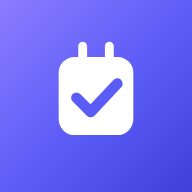
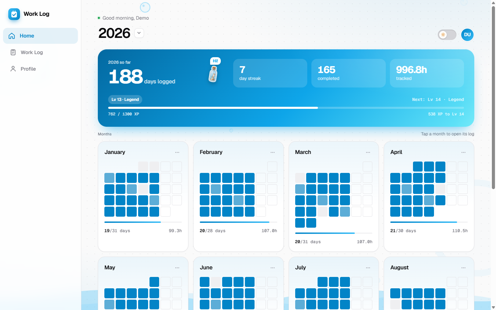
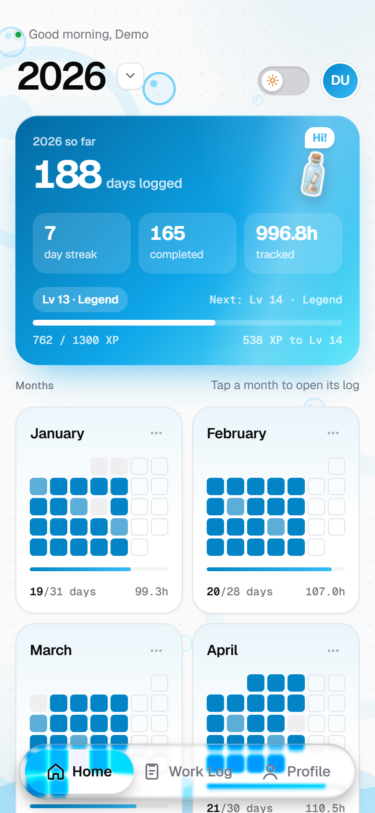
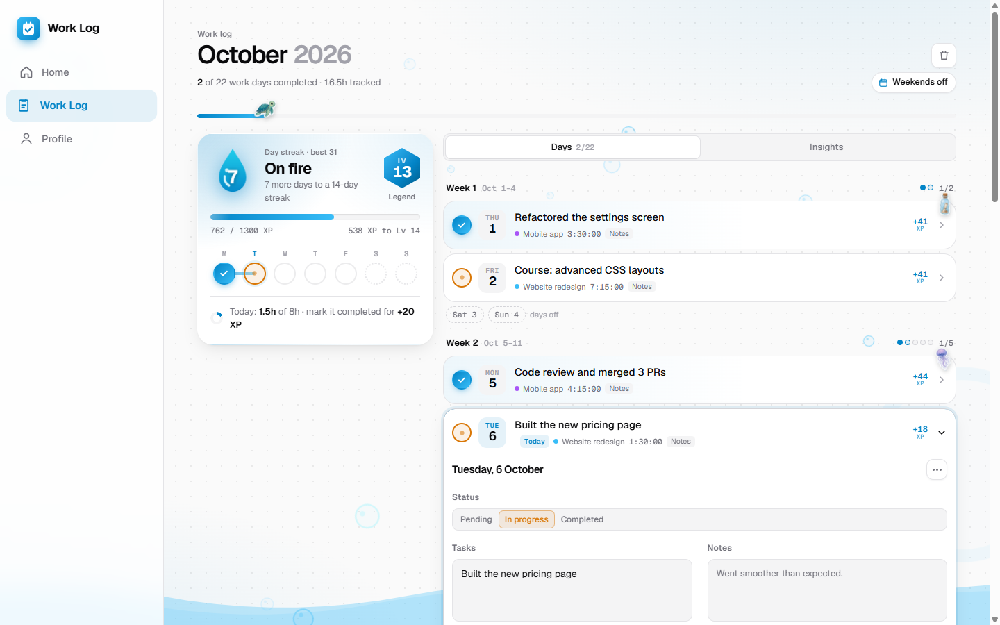
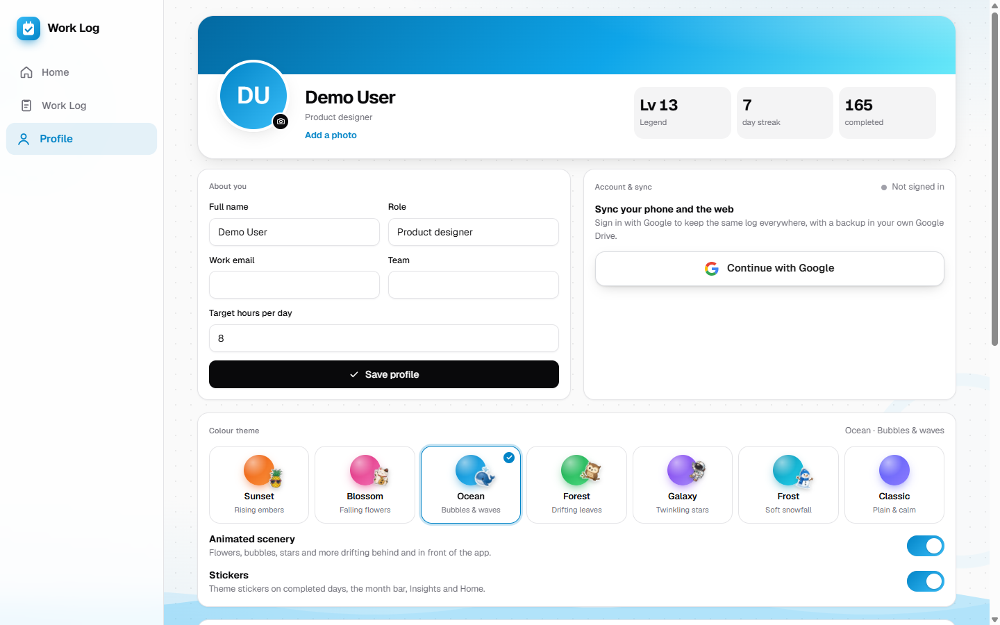
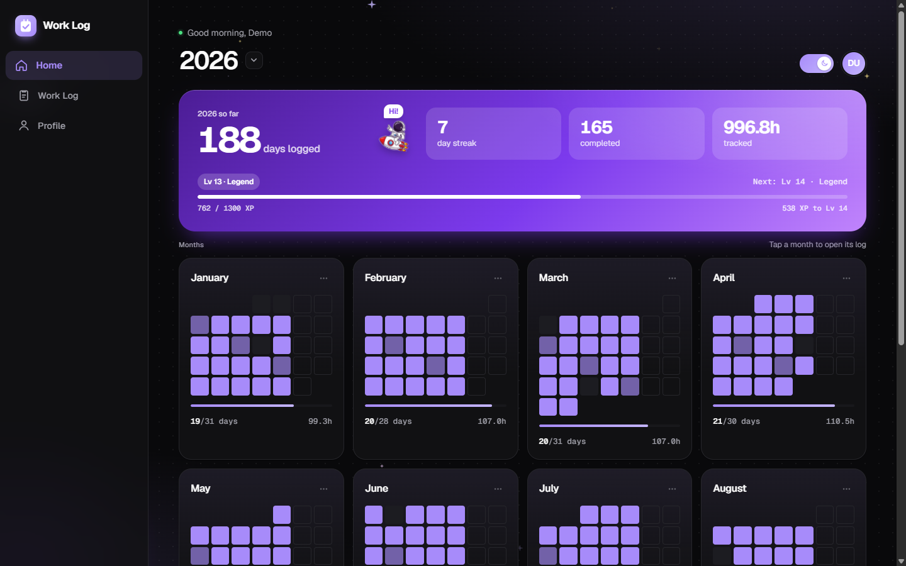
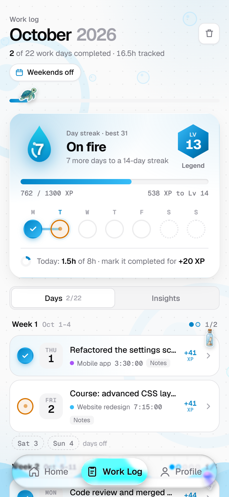
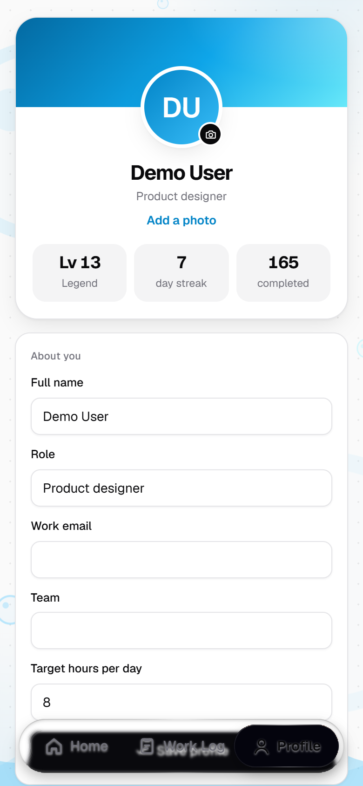
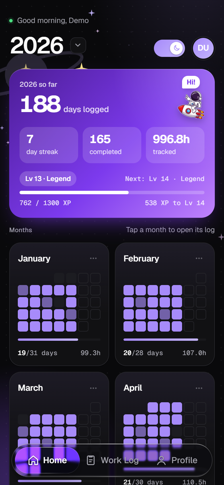
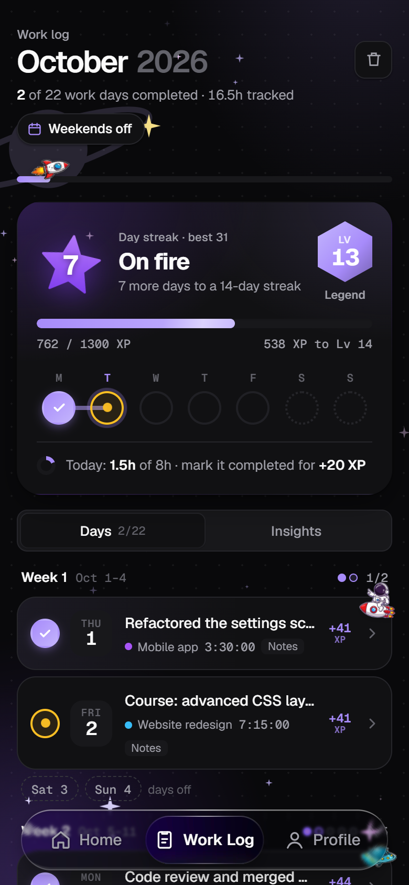

# Work Log

**A daily work log that feels like a game.**
Log what you did, time it, keep your streak alive, level up — on the web and on Android.

[**Open the web app**](https://arunava-ctrl.github.io/work-log/) ·
[**Download the Android app (APK)**](https://github.com/arunava-ctrl/work-log/releases/latest/download/WorkLog.apk) ·
[All releases](https://github.com/arunava-ctrl/work-log/releases) ·
[Privacy](https://arunava-ctrl.github.io/work-log/privacy.html)

  
  

---

## What it is

Work Log is a personal journal for your working days. Each day you note your tasks, add notes or photos,
run a timer (or type in the time), and mark the day **In progress** or **Completed**. The app turns that
into streaks, XP, levels and achievements, so keeping a log becomes a small daily win instead of a chore.

It comes in two versions built from **one shared interface**, so they look and work the same:

| | 🌐 Web app | 📱 Android app |
| --- | --- | --- |
| Get it | [arunava-ctrl.github.io/work-log](https://arunava-ctrl.github.io/work-log/) | [WorkLog.apk](https://github.com/arunava-ctrl/work-log/releases/latest/download/WorkLog.apk) |
| Layout | Desktop sidebar on wide screens, phone layout on mobile | Phone layout with a floating glass dock |
| Offline | Yes — install it from the browser menu ("Install app" / "Add to Home screen") | Yes, fully offline |
| Backup | Automatic backup to a file you choose (Chrome/Edge), or a download | Automatic backup to `Documents/WorkLog/` plus Android's own backup |
| Reminders | — | Daily reminder notification that skips your days off |
| Camera | Photo upload | Take a photo straight from the day |
| Updates | Refreshes itself when a new version is published | Checks GitHub Releases and offers the new APK in-app |
| Sync | Optional Google sign-in syncs both versions | Optional Google sign-in syncs both versions |

---

## ✨ What makes it special

### 🔥 Gamified, not a spreadsheet
- **Streaks** with a themed emblem (sun, blossom, water drop, leaf, star, ice crystal or flame) that grows as your streak does.
- **XP and levels** — completed days, tasks, notes and timed hours all earn XP, with a progress bar to the next level.
- **Achievements** like *Hat trick*, *Week warrior* and *Perfect week*, shown on your profile once earned.
- A **Mon–Sun strip** and a daily goal ring ("1.5h of 8h · mark it completed for +20 XP").

### 🎨 Seven living themes
Sunset, Blossom, Ocean, Forest, Galaxy, Frost and Classic — each with its own colours, **animated scenery**
(embers, falling petals, bubbles, leaves, stars, snow) and a set of **moving stickers** that swim, fly, hop or
sway around the screens. Light and dark mode, or follow the device. Everything can be switched off for a calm look.

### 🫧 Modern, polished interface
A floating **liquid-glass navigation dock**, a liquid dark-mode toggle, month tiles that are mini calendars,
staggered entrances and count-up numbers. On a desktop it becomes a full layout with a sidebar and two-column views.

### ⏱️ Honest time tracking
Start/stop timer per day, or **add time by hand**. Hand-entered time counts toward your hours but earns no XP —
so the score stays honest.

### 📸 Rich days
Tasks, notes, a colour tag per project, and up to 8 pictures per day. Set your **work schedule**
(e.g. "Weekends off") and days off never break your streak.

### 📊 Insights
A Days view grouped by week and an Insights view with totals, hours and patterns for the month.

### 🔒 Your data stays yours
- **No server and no ads.** Your log lives on your device.
- **Optional** Google sign-in syncs through *your own* Google Drive (a private app folder only Work Log can see).
  "Use without an account" works just as well.
- **Automatic backups** after every change, and restore on a fresh install.
- The app starts **completely empty** — no sample data.

---

## 📸 Screenshots

### Web app (desktop)

| Home | Work Log |
| --- | --- |
|  |  |
| **Profile** | **Dark mode · Galaxy theme** |
|  |  |

### Android app

  
  
  
  
  

Screenshots use demo data. A fresh install starts empty.

---

## 📲 Install

**Web:** open [arunava-ctrl.github.io/work-log](https://arunava-ctrl.github.io/work-log/). To use it like an app,
choose **Install app** (Chrome/Edge) or **Add to Home screen** (Safari/Android) from the browser menu.

**Android:**
1. Download [WorkLog.apk](https://github.com/arunava-ctrl/work-log/releases/latest/download/WorkLog.apk) on your phone or tablet.
2. Open it and allow **Install unknown apps** for your browser or file manager when Android asks.
3. That's it — the app will tell you when a newer version is out.

Requires Android 8.0 or newer. The app isn't on the Play Store; releases are published here on GitHub.

---

## 🛠️ How it's built

- **One interface for both:** a single hand-written HTML/CSS/JavaScript page, no framework, with the Geist font bundled.
- **Web:** published on GitHub Pages as an installable PWA with a service worker for offline use.
- **Android:** a small Kotlin shell around a WebView that adds what a web page can't do alone —
  reminders, file backups, the camera, Google sign-in, sharing and in-app updates.
- **Sync:** Google Drive `appDataFolder`, merged per day so edits on the phone and the web don't overwrite each other.

---

Copyright (c) 2026 arunava-ctrl. All rights reserved. This repository only hosts the published app.
No licence is granted to copy, modify, host or redistribute any part of it. See <a href="LICENSE">LICENSE</a>
and <a href="THIRD-PARTY-NOTICES.md">THIRD-PARTY-NOTICES.md</a>.

